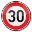
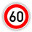

# Traffic Sign Recognizer - Writeup

## Data-set exploration

### General information

The given data-set consist of 3 packages of data, training and validation data is already split.
All data is load in code cell 1.

### Statistics

In cell 2 a short exploration of the data is done. All packages contain RGB images width a shape
of 32x32 pixel, as well as the label which is one of 43 classes.
The model is trained with a set of 34799 samples and tested with 12630 samples.

### Visual exploration

Visual exploration in cell 3 shows that many (but not all) of the sample are very dark which
makes me think that normalization shall improve the results of the recognizer as it does not
need to handle the differences in lightning by itself.

## Design of an architecture

As a starting point the LeNet-architecture was transferred and adapted to the 3-channel-RGB-data.
A quick test on gray-scale images did not bring any benefits in detection, so I decided to stay
with colored images.

### Pre-processing

All pre-processing is done in code cell 4 and is kept very simple. Normalization is applied to
all samples (training, validation, test-data).

Some tests showed that increasing the training-set improved the recognition-rate much more than
tuning the hyper-parameters of the network, so I focused on "creating" new data. This is achieved
by simply reusing the existing training-data, rotate the image a bit to left and right and add it
again to the set.

### Model Architecture

The network is defined in code cell 6.

The architecture of the tensorflow-network is exactly a one-2-one-copy of LeNet, which the number
of input-dimensions increased to 3 (for the RGB-channels) and the number of logits increased to
the number of classes in the data set (43).

It looks like this:
1. Convolutional layer with a 5x5-filter, Input 32x32x3, Output 28x28x6
2. Max-pooling to reduce the size to 14x14x6
3. Convolutional layer with a 5x5-filter, Input 14x14x6, Output 10x10x6
4. Max-pooling to reduce the size to 5x5x6
5. Flat to 400, as input for next Layer
6. Fully connected nodes, add relu to make it non-linear, Output 267
7. Fully connected nodes, add relu to make it non-linear, Output 178
8. Fully connected nodes, Output = number of classes = 43

### Model Training

Code for training in code cells 7 to 10 is straightforward and not special to the traffic
sign recognizer. It is a one-2-one-copy from the LeNet-example, adapted to the different data.

Training was repeated multiple times during tuning of the pre-processing but gave good results more
or less directly from the start.

## Testing with own images

For further testing I randomly picked images from the de.wikipedia.org, cut and resized them
to fit the training and validation data. To save additional effort in creating pickle-files
I simply stored them with their class in the filename.
Unfortunately all images have been detected correctly, so there is not much to discuss about
the performance of the recognizer. Reason is probably that the images are of much better quality
than the training data and what a camera would detect. Here is the output of the recognition
together with the probabilities of the detection:

Class | Class-name | image | probably
--- | :---: | --- | ---
1 | Speed limit 30km/h |  | 100%
3 | Speed limit 60km/h |  | 100%
12 | Priority road |  | 100%
13 | Yield |  | 100%
18 | General caution |  | 100%
